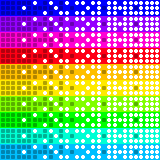
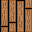

# 🎲🪦 DIE SCREAMING!

DIE SCREAMING! is a 2D tabletop game with ten-sided dice (D10) running in a 960 × 720 px window at 60 FPS. The player progresses through 7 levels, each requiring a target score (5 / 10 / 25 / 50 / 100 / 250 / 500 points) within a maximum of 10 throws. Throw power is charged by holding Space and screaming into the microphone. On Game Over, one extra try can be earned by screaming again or scanning the QR code.


---

## 🕹 ️Gameplay

You start each level with **10 tries** and a set of dice placed on the floor. Your goal is to reach the required score before you run out of tries.

- **Select** a die by clicking it
- **Hold Space** and scream — the louder you are, the more the throw-power bar fills
- **Release Space** to throw the selected die
- **Press Enter** to skip your remaining tries and go straight to the score check
- **Press R** to restart from level 1

After every throw, dice bounce off walls and each other using real physics. Dice values are locked once they stop moving. The score updates live as values settle.

If you reach the required score before running out of tries, you advance to the next level. Fail and you get a **Game Over** — but you can earn one extra try by screaming loud enough at the Game Over screen.


### Levels

| Level | Required score | Dice on the board |
| ----- | -------------- | ----------------- |
| 1     | 5              | 1                 |
| 2     | 10             | 2                 |
| 3     | 25             | 3                 |
| 4     | 50             | 4                 |
| 5     | 100            | 6                 |
| 6     | 250            | 8                 |
| 7     | 500            | 10                |

---

## 🎮 Controls

| Input                 | Action                 |
| --------------------- | ---------------------- |
| Left click on a die   | Select it              |
| Hold `Space` + scream | Charge throw power     |
| Release `Space`       | Throw the selected die |
| `Enter`               | Skip remaining tries   |
| `R`                   | Restart from level 1   |
| `Esc` / back arrow    | Return to menu         |

---

## 📊 Score calculation

The score is the **current sum of all dice on the board** — past throws don't accumulate; each die contributes exactly once based on its current face value. The formula is shown live on screen as a breakdown.

### Rules (applied in priority order)

**1. Straights** — three or more consecutive unique values form a straight. The whole run scores `sum × 10`. Dice used in a straight do not also score as singles.

```
Example: dice showing 2, 3, 4, 5  →  (2 + 3 + 4 + 5) × 10 = 140
```

**2. Multiples** — two or more dice showing the same value score `value × count²`.

```
Example: three 7s  →  7 × 3 × 3 = 63
Example: pair of 5s  →  5 × 2 × 2 = 20
```

**3. Singles** — any die not part of a straight or a multiple scores its face value.

```
Example: a lone 4  →  4
```

| Situation     | Formula       | Example             |
| ------------- | ------------- | ------------------- |
| Single die    | `value`       | 7 → **7**           |
| Pair          | `(v × n) × n` | 2, 2 → **8**        |
| Triple        | `(v × n) × n` | 3, 3, 3 → **27**    |
| Straight (3+) | `sum × 10`    | 1, 2, 3 → **60**    |
| Combined      | sum of both   | 1, 2, 2, 3 → **68** |

These rules combine. A board showing `2, 3, 4, 7, 7, 9` scores:

- `2, 3, 4` straight: `(2 + 3 + 4) × 10 = 90`
- `7, 7` pair: `7 × 2 × 2 = 28`
- `9` single: `9`
- **Total: 127**


---

## 🖼 ️Sprites

### D10 sprite sheet

`sprites/d10-rainbow.png` is a **10 × 10 grid**. Each row is a colour variant (0–9); each column is a face value (0–9). The loader slices it into individual frames on startup and stores them as `faces[color_variant][value]`.



### Floor tile

`sprites/floor-tile.png` is a wooden-plank tile repeated across a 28 × 12 grid to build the game board.



---

## 🏗 ️Project structure

```
main.py               # Entry point — init, asset loading, screen router
settings.py           # All constants: colours, paths, game rules, dimensions
game.py               # GameSession class, game_loop, throw helpers
screens.py            # Intro, menu, controls, scoring screens
ui.py                 # All rendering: floor, widgets, HUD, end screen, AnimatedGif
audio.py              # ShoutMeter — microphone input and shout detection

d10_dice.py           # Die entity: creation, physics, collision, placement, drawing
d10_score.py          # Score calculation and per-group breakdown
d10_score_formula.py  # Live score formula bar rendered on screen
d10_sprites.py        # Sprite sheet loading and face extraction
d10_roll.py           # Roll animation state machine (idle / active / result)
d10_roll_effects.py   # Animated mini-die travel effect (legacy)

sprites/
  d10-rainbow.png     # 10×10 sprite sheet: 10 colour variants × 10 faces (0–9)
  floor-tile.png      # Repeating floor tile
  qr.png              # QR code shown on Game Over screen
  rage_quit.gif       # Animated GIF shown on Game Over screen

docs/
  Pygame2026_workshop_final.pdf   # Workshop slides (Karel Šafr, Ph.D.)
```

---

## 🧠 Key modules

### `d10_dice.py` — physics and dice

Each die is a dictionary holding position (`x`, `y`), velocity (`vx`, `vy`), rotation angle, and current face value. Motion is integrated every frame in `update_die_motion`. Friction is applied exponentially (`FRICTION ^ frame_scale`; `FRICTION = 0.988`). Wall bounces preserve `WALL_BOUNCE = 0.72` of the incoming speed. Die–die collisions are resolved in `resolve_die_collision` using an impulse method with `DIE_BOUNCE = 0.86`. A die stops when `|v| < STOP_SPEED` (18 px/s).

When thrown, `throw_die` aims the die toward the nearest other die with a small random spread and applies a random spin (`spin_velocity`). The face value cycles every 90 ms through a randomly shuffled sequence during flight; the final value is whatever face is showing when the die stops.

### `game.py` + `audio.py` — game loop and microphone

`GameSession` holds the dice list, remaining tries, current level, and a `waiting_for_settle` flag — the score check only happens once all dice have stopped. The screen state machine lives in `main.py`: `intro → menu → game / controls / scoring`.

**ShoutMeter** (`audio.py`) reads the microphone via `sounddevice` on a background thread and continuously updates the RMS volume level. During a throw charge, `throw_power` is driven by the current microphone volume (or by holding Space in `hold` mode — controlled by `THROW_POWER_MODE` in `settings.py`). On Game Over, ShoutMeter listens for a shout above the threshold and calls `grant_shout_retry`.

### `d10_score.py` — scoring

```python
def calculate_score(dice_values): ...
def score_breakdown(dice_values): ...  # same logic, returns labelled groups for the UI
```

The function processes the list of die values in three passes:

1. **Straights** — finds all maximal runs of ≥ 3 consecutive unique values. Each run contributes `sum × 10` and marks those values as used.
2. **Multiples** — for each value appearing ≥ 2 times, contributes `(value × count) × count`.
3. **Singles** — values with count 1 that are not part of any straight contribute their face value.

### `d10_score_formula.py` — live formula bar

Calls `score_breakdown()` to get labelled groups, then renders die icons (using the correct colour variant from the actual dice) grouped by combo type with coloured badges. Groups are separated by `+` signs and the total is appended with `=`. The bar is horizontally centred on a semi-transparent panel.

---

## 🛠 Setup

**Requirements:** Python 3.9+, a working microphone (optional — hold Space without screaming if unavailable)

**Technology:** Python 3.12, Pygame 2.6, sounddevice 0.5

```bash
# Create and activate a virtual environment
python -m venv .venv
source .venv/bin/activate   # Windows: .venv\Scripts\activate

# Install dependencies
pip install -r requirements.txt

# Run
python main.py
```

> Pygame cannot run inside Jupyter or any environment that hosts its own main loop. Run from a regular terminal.

To verify your Pygame installation:

```bash
python -m pygame.tests
```

## 💻 Contributors

This game was developed by a team of four as part of a workshop at Unicorn University. The team members are:

- Bc. Tomáš Grusz ([@tomasgrusz](https://github.com/tomasgrusz))
- Bc. Kristian Kolumber ([@kolumber23](https://github.com/kolumber23))
- Bc. Apolena Kučerová ([@apikucerova-kickass](https://github.com/apikucerova-kickass))
- Bc. Tomáš Pour ([@pourik20](https://github.com/pourik20))
